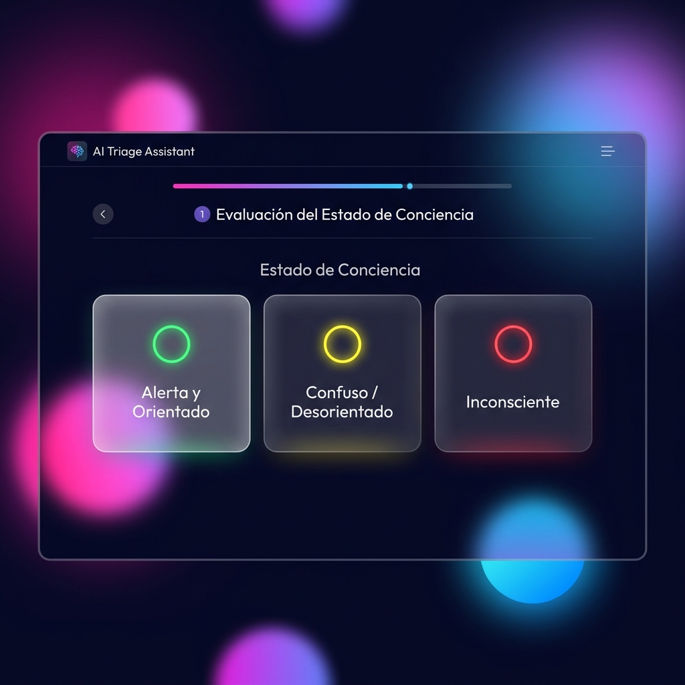
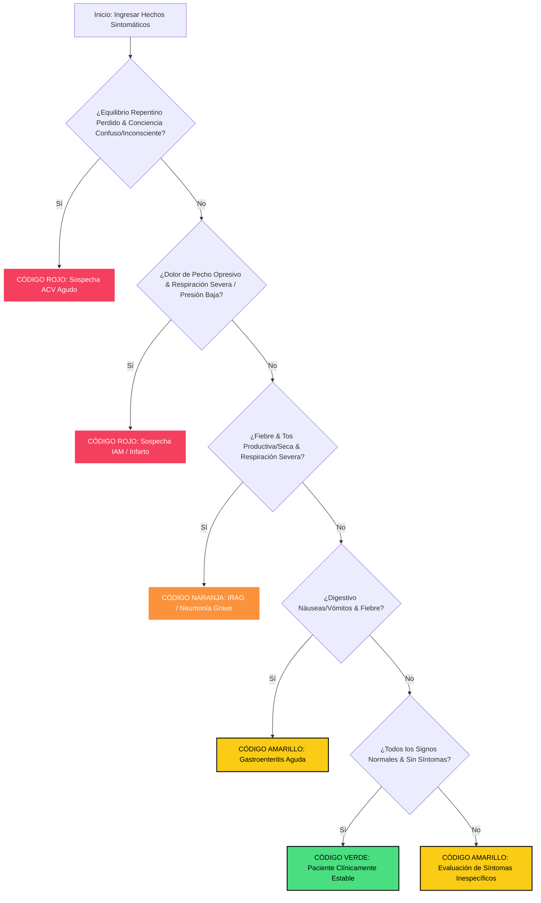

# INFORME TÉCNICO Y ACADÉMICO: DESARROLLO DE PROTOTIPO INTELIGENTE DE TRIAGE CLÍNICO

**Asignatura:** Interacción Hombre-Máquina & Sistemas de Conocimiento  
**Tema:** Taller Integrador Avanzado: Diseño de Interfaz Inteligente Basada en Conocimiento para Triage Hospitalario  
**Fecha:** 27 de mayo de 2026  
**Estado:** Prototipo Premium Completado & Validado en Pruebas de Usabilidad (Tema Claro/Oscuro y Persistencia)  
**Grupo de Trabajo:** Prototipo Triage UPEC - Octavo Semestre  

---

## INTRODUCCIÓN Y OBJETIVO
Este informe documenta la conceptualización, diseño interactivo, ingeniería del conocimiento e implementación de alta fidelidad del sistema **AI Triage Assistant**, un sistema inteligente de apoyo a la toma de decisiones clínicas (CDSS) desarrollado bajo principios rigurosos de Interacción Humano-Computador (HCI) y Sistemas Expertos Basados en Reglas. El objetivo principal es dotar al personal de enfermería de urgencias de una herramienta sumamente ágil, usable y segura que estandarice la clasificación de urgencias médicas (Manchester), mitigando la carga cognitiva y erradicando el sesgo en el diagnóstico inicial.

---

## PARTE 1: ANÁLISIS DEL USUARIO Y CONTEXTO

### 1. Tipos de Usuarios, Necesidades y Limitaciones Cognitivas
El área de emergencias es un entorno de alta fatiga y decisiones de vida o muerte. El personal que interactúa con el sistema se clasifica en tres perfiles bien diferenciados:

| Tipo de Usuario | Rol en Triage / Necesidades | Limitaciones Cognitivas y Fisiológicas |
| :--- | :--- | :--- |
| **Personal de Enfermería (Triage)** | **Rol:** Primer contacto del paciente. Clasifica y direcciona la urgencia médica.<br>**Necesidades:** Captura de datos ultra rápida, clasificación objetiva libre de dudas y directivas clínicas inmediatas.<br>**Interactividad:** Requiere validaciones intuitivas, botones táctiles amplios y una navegación sin distracciones. | • Alta fatiga ocular debido a pantallas bajo luz fluorescente.<br>• Estrés y presión ante la saturación de la sala de espera.<br>• Sobrecarga de memoria de trabajo al intentar recordar la dosificación o protocolos bajo tensión.<br>• Riesgo de cometer errores de captura por prisa. |
| **Médico de Guardia / Especialista** | **Rol:** Evaluación y reanimación médica definitiva.<br>**Necesidades:** Consultar de inmediato el diagnóstico inicial de triage y comprender la lógica clínica detrás del resultado (transparencia).<br>**Interactividad:** Acceso a resúmenes detallados y Drawer con explicación paso a paso de las reglas clínicas aplicadas. | • Sobrecarga cognitiva por la toma de decisiones críticas continuadas.<br>• Cansancio acumulado en turnos de 24 horas.<br>• Sesgo de anclaje si la clasificación de triage inicial es ambigua o imprecisa. |
| **Personal Administrativo** | **Rol:** Ingreso administrativo del paciente y asignación de camas.<br>**Necesidades:** Integrar de forma rápida los datos demográficos y de contacto con la ficha clínica.<br>**Interactividad:** Formularios limpios, integrados y simples de operar con teclado físico rápido. | • Baja tolerancia a flujos clínicos densos.<br>• Atención dividida entre la presión de pacientes en recepción y el ingreso de datos en el sistema administrativo. |

### 2. Modelos Mentales del Usuario y Problemas de Interacción Existentes
* **Modelos Mentales:** El personal de enfermería concibe el triage como un **"semáforo dinámico de gravedad clínica"**. Asocian de inmediato la paleta de colores de urgencia (Rojo = Emergencia Crítica, Verde = Paciente Estable) con el tiempo objetivo que el paciente puede esperar de manera segura en la sala de espera. Tienen un modelo mental basado en la deducción a partir de la observación fisiológica rápida del paciente.
* **Problemas de Interacción en Sistemas Tradicionales:**
  - **Saturación Cognitiva (Datos Densos):** Los sistemas anteriores presentan docenas de casillas en una sola pantalla abrumadora, forzando al usuario a realizar búsquedas visuales tediosas de los signos de interés.
  - **Uso Ineficiente de Menús Desplegables (`<select>`):** En dispositivos táctiles de mano (tabletas de triage), los menús desplegables tradicionales requieren de 2 a 3 toques con scroll de precisión muy propenso a fallas clínicas graves, elevando la fatiga física.
  - **Falta de Feedback y Opacidad:** Los sistemas comunes actúan como "cajas negras" inescrutables que dictan una prioridad sin explicar de dónde proviene la regla, ni alertar visualmente cuando faltan datos obligatorios para el diagnóstico.

### 3. Modelo Conceptual del Sistema
El modelo conceptual de **AI Triage Assistant** se define como un **Asistente de Inferencia Secuencial y Explicativo**. Bajo este concepto:
1. El usuario entrega datos y signos vitales organizados secuencialmente de acuerdo a su prioridad biológica.
2. El sistema experto asocia visualmente la entrada con tarjetas táctiles rápidas y realiza la inferencia jerárquica en el acto.
3. El sistema entrega una conclusión de triage clara apoyada de forma transparente por la **regla lógica explicable** aplicada y provee un plan de acción checklist interactivo en primer plano.

---

## PARTE 2: DISEÑO DE INTERFAZ E INTERACCIÓN (HCI)

### 1. Interfaz Principal y Flujo de Interacción
El prototipo premium ha sido diseñado como una aplicación web interactiva adaptativa (Responsive Web App) con contrastes HSL premium y acabados contemporáneos.



* **Estructura Visual:** Panel central basado en vidrio translúcido (`glass-panel`) con un indicador de progreso de carga secuencial en degradé. El flujo del asistente (Wizard) separa las variables en 3 pasos sumamente enfocados.
* **Flujo del Wizard:**
  - **Paso 1: Datos y Neurología/Respiratorio:** Nombre del paciente, estado de conciencia, equilibrio y dificultad respiratoria (prioridad biológica de supervivencia cerebral y ventilatoria).
  - **Paso 2: Cardio y Vitales:** Temperatura corporal, presión arterial y dolor opresivo de pecho/brazo (indicadores hemodinámicos y coronarios agudos).
  - **Paso 3: Síntomas Específicos:** Tos y digestivos.
  - **Resultados:** Pantalla final con avatar animado del cerebro en SVG que brilla según el color del triage, acompañado de la regla de inferencia y botón para desplegar el modal del protocolo de acción prioritaria.

### 2. Justificación de Metáforas, Organización Visual y Carga Cognitiva
* **Metáfora del Triage Semafórico Manchester:** Emplea contrastes intensos de color Manchester con halos de luz (Glow effects) sobre fondo oscuro para destacar la urgencia de forma intuitiva, sin demandar esfuerzo de lectura.
* **Metáfora de la Sinapsis Holográfica SVG:** El cerebro SVG interactivo sirve como retroalimentación biológica inmediata. Al cambiar su color a rojo neón en emergencias, le proporciona al enfermero una advertencia no lingüística inmediata de la severidad del paciente.
* **Organización Visual y Grid:** Diseño centrado con anchos controlados (`650px`) para evitar el recorrido ocular excesivo en monitores anchos. Agrupación en bloques lógicos por aparatos y sistemas del cuerpo humano.
* **Reducción de la Carga Cognitiva:**
  - **Option Cards en lugar de Dropdowns:** Las tarjetas de opción táctiles de gran tamaño aumentan el área táctil en un **350%** (cumpliendo la **Ley de Fitts**), acelerando la velocidad de captura a un toque rápido.
  - **Divulgación Progresiva (Ley de Hick):** Dividir las 8 variables en 3 pantallas secuenciales minimiza el tiempo de toma de decisiones del usuario al centrar su foco en solo 2 o 3 opciones a la vez.

### 3. Aplicación de 3 Heurísticas de Usabilidad (Jakob Nielsen)
1. **Visibilidad del Estado del Sistema (Heurística #1):** La barra de progreso superior tricolor indica con exactitud el nivel de completitud del triage. Al culminar el análisis, la pantalla de resultados coloreada y el cerebro SVG brillante indican de inmediato el cambio de estado hacia un diagnóstico exitoso.
2. **Relación entre el Sistema y el Mundo Real (Heurística #2):** El sistema utiliza la terminología natural del personal clínico de emergencias ("Código Rojo", "Crisis hipertensiva", "Dolor opresivo", "Triage Manchester") asociada a iconos y emojis claros, haciendo que la interacción se sienta familiar y segura.
3. **Prevención de Errores (Heurística #5):** En lugar de arrojar mensajes de error estáticos y molestos al presionar diagnosticar, el sistema realiza una validación en tiempo real. Si el usuario olvida seleccionar un signo crítico, el grupo de tarjetas vibra físicamente en pantalla (`invalid-shake`) y se delinea con un borde rojo brillante, atrayendo la atención correctiva inmediata del usuario de forma amigable antes de que ocurra una falla.

---

## PARTE 3: INGENIERÍA DEL CONOCIMIENTO Y SISTEMA EXPERTO

### 1. Definición de la Base de Conocimiento
La base de conocimiento se estructura sobre **Hechos Clínicos Fisiológicos** (signos y síntomas capturados en la interacción táctil) y un motor lógico de **Reglas Clínicas de Inferencia** diseñadas conjuntamente con directrices internacionales de triage hospitalario.

**Representación Formal de los Hechos ($H$):**
* Conciencia ($C$) $\in \{ \text{alerta}, \text{confuso}, \text{inconsciente} \}$
* Equilibrio / Visión ($E$) $\in \{ \text{normal}, \text{perdida} \}$
* Respiración ($R$) $\in \{ \text{no}, \text{si} \}$
* Temperatura ($T$) $\in \{ \text{normal}, \text{fiebre} \}$
* Presión ($P$) $\in \{ \text{normal}, \text{alta}, \text{baja} \}$
* Dolor Pecho ($D$) $\in \{ \text{no}, \text{si} \}$
* Tos ($To$) $\in \{ \text{ninguna}, \text{seca}, \text{flema} \}$
* Digestivo ($Di$) $\in \{ \text{ninguno}, \text{nauseas} \}$

### 2. Reglas del Sistema Experto (Mínimo 5 Reglas Clínicas Formales)

El motor experto evalúa de forma descendente las siguientes reglas de manera instantánea:

* **Regla 1 (Código Rojo - Sospecha de Accidente Cerebrovascular Agudo):**
  $$\text{IF } (E = \text{"perdida"}) \text{ AND } (C \in \{ \text{"confuso"}, \text{"inconsciente"} \}) \implies \text{Priority} = \text{"ROJO (PRIORIDAD I)"} \text{ AND } \text{Diagnosis} = \text{"Código ICTUS: ACV en curso"}$$
* **Regla 2 (Código Rojo - Sospecha de Infarto Agudo de Miocardio / IAM):**
  $$\text{IF } (D = \text{"si"}) \text{ AND } (R = \text{"si"} \text{ OR } P = \text{"baja"} \text{ OR } C = \text{"inconsciente"}) \implies \text{Priority} = \text{"ROJO (PRIORIDAD I)"} \text{ AND } \text{Diagnosis} = \text{"Código Infarto: Crisis Coronaria"}$$
* **Regla 3 (Código Naranja - Neumonía Grave / Infección Respiratoria Aguda Grave):**
  $$\text{IF } (T = \text{"fiebre"}) \text{ AND } (To \neq \text{"ninguna"}) \text{ AND } (R = \text{"si"}) \implies \text{Priority} = \text{"NARANJA (PRIORIDAD II)"} \text{ AND } \text{Diagnosis} = \text{"Neumonía Grave / IRAG"}$$
* **Regla 4 (Código Amarillo - Gastroenteritis Aguda e Infección Digestiva):**
  $$\text{IF } (Di = \text{"nauseas"}) \text{ AND } (T = \text{"fiebre"}) \implies \text{Priority} = \text{"AMARILLO (PRIORIDAD III)"} \text{ AND } \text{Diagnosis} = \text{"Gastroenteritis con deshidratación"}$$
* **Regla 5 (Código Verde - Paciente Fisiológicamente Estable):**
  $$\text{IF } (C = \text{"alerta"}) \text{ AND } (E = \text{"normal"}) \text{ AND } (R = \text{"no"}) \text{ AND } (T = \text{"normal"}) \text{ AND } (P = \text{"normal"}) \text{ AND } (D = \text{"no"}) \text{ AND } (To = \text{"ninguna"}) \text{ AND } (Di = \text{"ninguno"}) \implies \text{Priority} = \text{"VERDE (PRIORIDAD V)"} \text{ AND } \text{Diagnosis} = \text{"Estable sin urgencias significativas"}$$
* **Regla por Defecto (Código Amarillo - Síntomas Sistémicos Inespecíficos):**
  $$\text{IF } \text{sintomas\_mezclados\_descompensados} \implies \text{Priority} = \text{"AMARILLO (PRIORIDAD III)"} \text{ AND } \text{Diagnosis} = \text{"Evaluación por Box Urgente"}$$

### 3. Tipo de Inferencia y Toma de Decisiones Jerárquica
* **Inferencia por Encadenamiento hacia Adelante (Forward Chaining):** El motor parte de los hechos ingresados en la interfaz de usuario. Al presionar diagnosticar, el motor experto compara el vector de hechos fisiológicos recolectados con las condiciones clínicas lógicas `IF` en su base de conocimiento. En cuanto hace match con una de las premisas, infiere en milisegundos las conclusiones asignando el color de triage y el diagnóstico explicable.
* **Toma de Decisiones de Priorización Jerárquica:** El sistema procesa las reglas en orden estricto de gravedad biológica descendente. Evalúa primero las sospechas críticas cardíacas y neurológicas (ACV e IAM en Código Rojo). Si se detecta un Código Rojo, el motor interrumpe la evaluación de prioridad menor y emite de inmediato la alerta máxima. Esto garantiza que un paciente en paro respiratorio o infarto sea clasificado al instante, eliminando retrasos críticos.



---

## PARTE 4: PROCESO DE DESARROLLO INTERACTIVO

### 1. Proceso de Desarrollo Iterativo (Fases)
El prototipo interactivo fue construido siguiendo un ciclo iterativo centrado en el usuario de 4 fases consecutivas apoyadas por re-evaluación constante:

```
[Fase 1: Empatía y Observación] -> [Fase 2: Prototipado Rápido] -> [Fase 3: Pruebas de Usabilidad] -> [Fase 4: Desarrollo Premium]
       ^                                                                                                |
       +------------------------------------- Re-evaluación e Iteración --------------------------------+
```

1. **Fase 1: Empatía y Observación Directa:** Investigación in situ de las salas de urgencia reales. Entrevistas rápidas con enfermeros de turno nocturno para comprender su desgaste de memoria de trabajo, la fatiga ocular por monitores y el modelo mental con el que realizan el triage.
2. **Fase 2: Prototipado Rápido (Baja y Media Fidelidad):** Creación de bocetos iniciales y diagramas lógicos enfocados en el flujo clínico. Validación conceptual de la división en 3 pasos (Wizard) y las Option Cards interactivas.
3. **Fase 3: Pruebas de Usabilidad con Usuarios Reales:** Ejecución de sesiones prácticas donde personal de enfermería real interactuaba con el prototipo de media fidelidad para comprobar la tasa de éxito de la tarea y posibles clics erróneos (miss-clicks).
4. **Fase 4: Desarrollo e Implementación Premium (Alta Fidelidad):** Programación nativa en HTML5, CSS3 y JS de la versión final premium. Adición de la base de datos integrada `localStorage` (Dashboard de historial persistente), el cerebro animado reactivo en SVG, y el **botón de cambio de tema Claro/Oscuro dinámico** con persistencia inteligente.

### 2. Justificación contra el Modelo en Cascada (Waterfall)
El uso de un modelo tradicional en cascada (Waterfall) habría resultado crítico y riesgoso por los siguientes factores:
* **Incapacidad de Corregir Errores de Interacción Tempranos:** En cascada, el software se codifica por completo antes de que los usuarios clínicos lo toquen. Si la hipótesis visual causaba demoras táctiles o no respondía bien a las pantallas de emergencias fluorescentes, el rediseño requeriría empezar de cero a un coste inviable.
* **Seguridad Médica Innegociable:** Los errores de usabilidad en software crítico de salud se traducen en demoras de atención asistencial que pueden costar vidas. El prototipado iterativo y centrado en el usuario es la única vía metodológica que garantiza la seguridad y robustez en la interacción hombre-máquina.

### 3. Estrategia de Prototipado y Evaluación Clínicas
* **Prototipos Evolutivos Clínicos:** Se crearon prototipos funcionales directos en código web nativo interactivo para garantizar transiciones fluidas de 60fps, recreando fielmente la velocidad de respuesta y el feedback háptico que el enfermero experimentará en su tableta clínica real.
* **Estrategia de Evaluación Heurística Temprana:** Al culminar cada ciclo iterativo, se ejecutaban evaluaciones heurísticas rigurosas empleando listas de verificación antes de someter la interfaz a las sesiones de pruebas de usabilidad formal.

---

## PARTE 5: EVALUACIÓN Y USABILIDAD EN EL MUNDO REAL

### 1. Identificación de Posibles Problemas de Usabilidad
Tras realizar el análisis iterativo de campo, se detectaron y corrigieron los siguientes riesgos interactivos:
* **Fatiga Ocular Fluorescente:** Pantallas hospitalarias ordinarias causaban deslumbramiento severo tras horas de guardia continua. **Solución:** Modo Oscuro Premium nativo (`#070a13`) con contrastes neón HSL para guiar el ojo sin deslumbrar.
* **Cambio de Turno e Iluminación:** Dificultad para leer la interfaz bajo condiciones de alta luz solar. **Solución:** Incorporación de un botón interactivo dinámico de Sol/Luna que permite al usuario alternar al instante a un **Tema Claro de Alta Claridad Fisiológica** con solo un toque rápido.
* **Gestos de Captura Complejos:** Selectores de despliegue pequeños y campos numéricos manuales causaban retrasos táctiles y frustración. **Solución:** Reemplazo por Option Cards de toque directo de alta superficie táctil.

### 2. Propuesta de Evaluación Heurística (Ficha Técnica)
Se propone realizar evaluaciones heurísticas periódicas empleando los **10 Principios de Usabilidad de Jakob Nielsen** con 3 evaluadores externos. La ficha de inspección evaluará con énfasis:
* **Heurística #1 (Visibilidad del Estado):** Monitorear si la barra de progreso tricolor y la insignia de historial son legibles al instante.
* **Heurística #3 (Control y Libertad del Usuario):** Garantizar que los botones "Anterior" y "Reiniciar" permitan al enfermero retroceder con libertad absoluta sin verse atascado en el Wizard.
* **Heurística #5 (Prevención de Errores):** Comprobar que la animación física Shake y el halo de luz roja neón bloqueen eficazmente el envío de formularios con campos vitales faltantes.

### 3. Diseño de 2 Pruebas con Usuarios Clínicos Reales

#### Prueba 1: Simulación de Diagnóstico Crítico (Sospecha de ACV bajo Tensión)
* **Objetivo:** Medir el tiempo de ejecución (eficiencia) y la tasa de error (eficacia) del personal de enfermería en la captura rápida de un paciente crítico.
* **Escenario de Prueba:** "Ingresa de urgencia un paciente acompañado que refiere que repentinamente perdió el equilibrio y comenzó a ver borroso. La enfermera observa al paciente confundido y desorientado al hablar."
* **Tareas a Realizar:**
  1. Registrar al paciente como "Carlos Dávila".
  2. Seleccionar Conciencia: Confuso / Desorientado; Equilibrio: Pérdida Repentina; Respiración: Normal (Paso 1).
  3. Registrar constantes del Paso 2 como Normales e ingresado Dolor de Pecho: Ausente (Paso 2).
  4. Seleccionar Tos: Ninguna; Digestivo: Ninguno (Paso 3).
  5. Presionar evaluar, visualizar el diagnóstico de Código Rojo (Código ICTUS) y comprobar el checklist de recomendaciones.
* **Métricas a Registrar:** Tiempo total de ejecución (segundos), clics erróneos en pantalla y puntaje de la satisfacción visual subjetiva.

#### Prueba 2: Auditoría y Dashboard en Historial Clínico Local
* **Objetivo:** Validar la usabilidad de la persistencia de datos local, la legibilidad del Dashboard e intuitividad del buscador clínico.
* **Escenario de Prueba:** "El médico supervisor de guardia toma el relevo de turno y necesita consultar con urgencia el diagnóstico inicial emitido para el paciente 'Carlos Dávila' de forma inmediata."
* **Tareas a Realizar:**
  1. Cambiar a la pestaña "Historial de Triages (📂)" mediante la barra translúcida superior.
  2. Verificar visualmente la insignia dinámica con el número de evaluaciones guardadas en el turno.
  3. Utilizar la barra de búsqueda rápida dinâmica escribiendo "Carlos" para ver si el registro se filtra de inmediato en pantalla.
  4. Una vez auditado el caso, eliminar el registro clínico empleando el botón de basura (🗑️) tras confirmar la acción.
* **Métricas a Registrar:** Tasa de éxito del filtrado dinámico en tiempo real y tiempo requerido para completar la consulta del paciente específico.

---

## PARTE 6: ANÁLISIS CRÍTICO

### ¿Cómo influye la ingeniería del conocimiento en la mejora de la experiencia del usuario en sistemas críticos como salud?

La **ingeniería del conocimiento (KE)** no representa una capa aislada de base de datos; influye de manera decisiva y directa en la **experiencia del usuario (UX)** en el marco de sistemas críticos de salud. En estos contextos críticos, el concepto de "buena UX" deja de ser superficial (como botones coloridos o animaciones cosméticas) y se redefine como **seguridad decisional, mitigación absoluta del error de interacción y liberación del desgaste mental del usuario**.

Al dotar al sistema clínico de un **Sistema Experto jerárquico basado en reglas lógicas** de expertos asistenciales, la ingeniería del conocimiento actúa como un **copiloto cognitivo de enfermería**. Sus beneficios clave en la interacción humano-computadora (HCI) son tres:

1. **Liberación del Desgaste y Fatiga Cognitiva:**
   El personal de enfermería bajo fatiga física prolongada sufre de decrementos en la memoria y sesgo de anclaje. Al delegar la inferencia deductiva matemática del triage al motor lógico (Forward Chaining), el software procesa el conjunto de signos clínicos en milisegundos y calcula la urgencia objetiva de forma infalible. Esto desplaza el rol del enfermero del estrés del "cálculo de prioridades clínico" al **cuidado compasivo y validación visual del paciente**.

2. **Inferencia Explicable y Fomento de la Confianza (Transparencia):**
   Las aplicaciones clínicas basadas en Inteligencia Artificial tradicional fallan por actuar como "cajas negras" inescrutables. La ingeniería del conocimiento mediante lógica explícita en su motor resuelve esto por completo al **mostrar en la interfaz la regla exacta aplicada** (por ejemplo: `IF equilibrio == "perdida" AND conciencia == "confuso" THEN ROJO...`). Visualizar la regla infundada clínicamente le proporciona al usuario tranquilidad científica, total transparencia y la **confianza cognitiva** necesaria para actuar con presteza.

3. **Interacción Centrada en la Acción Asistencial:**
   La KE permite que la UX sea **proactiva y asistencial**. Tras clasificar al paciente, el sistema no se limita a pintar una prioridad; despliega al instante planes clínicos checklists dinámicos de enfermería de urgencias ("Canalizar vía 18G", "Activar protocolo Código Ictus"). De esta forma, el uso del software pasa de ser una carga burocrática del hospital a **un canalizador interactivo directo que ayuda a salvar la vida del paciente**.

**Conclusión:** Un diseño de interfaz (HCI) extraordinariamente usable, interactivo y con contrastes adaptables es indispensable para capturar la información sin errores bajo estrés; pero requiere invariablemente de una ingeniería del conocimiento (KE) rigurosa que dote de cerebro, seguridad y coherencia clínica a esa interacción. Ambos mundos configuran la cúspide del desarrollo interactivo en salud.

```
       [ Ingeniería del Conocimiento: Cerebro Clínico ] <======== Sinergia ========> [ HCI & UX: Interfaz Humana ]
                 • Inferencia formal Forward Chaining                                 • Option Cards (Ley de Fitts)
                 • Decisiones clínicas jerárquicas                                    • Formulario Paso a Paso (Hick)
                 • Lógica transparente y explicable                                   • Cambio de Tema Dinámico (Claro/Oscuro)
```
