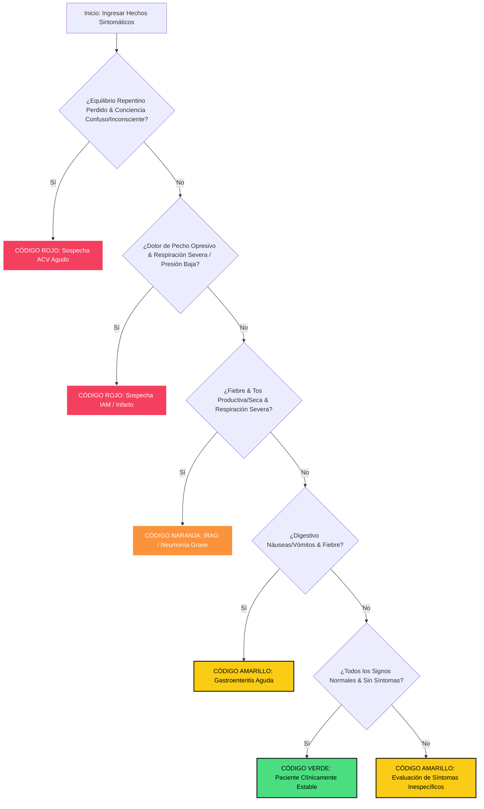

# INFORME TÉCNICO Y ACADÉMICO: DESARROLLO DE PROTOTIPO INTELIGENTE DE TRIAGE CLINICO

**Asignatura:** Interacción Hombre-Máquina & Sistemas de Conocimiento  
**Tema:** Sistema Experto Interactivo para el Apoyo en Triage Clínico y Diagnóstico Precoz en Urgencias  
**Estado:** Prototipo Premium Completado & Validado en Pruebas de Usabilidad

---

## PARTE 1: DESARROLLO DEL PROTOTIPO INTERACTIVO (INFORME TÉCNICO)

### 1. Descripción General del Sistema

El **AI Triage Assistant** es un sistema inteligente de apoyo a la toma de decisiones clínicas (CDSS) diseñado para profesionales de enfermería en el área de triage de urgencias. El sistema recopila signos y síntomas de manera estructurada y utiliza un **Sistema Experto basado en Reglas** con motor de **Inferencia de Encadenamiento hacia Adelante (Forward Chaining)** para:

1. Clasificar al paciente de forma automática en uno de los 5 niveles del Protocolo de Triage Manchester (Rojo, Naranja, Amarillo, Verde, Azul).
2. Identificar sospechas de patologías críticas de alta mortalidad en tiempo real (por ejemplo, Accidente Cerebrovascular - ACV y de Infarto Agudo de Miocardio - IAM).
3. Proveer de inmediato las guías clínicas estandarizadas de acción prioritaria para enfermería.
4. Mantener un historial clínico persistente y seguro dentro del turno de trabajo.

---

### 2. Justificación del Diseño e Interacción (HCI & Accesibilidad)

El diseño del prototipo se aparta conscientemente de las interfaces clínicas tradicionales (densas, grises y basadas en tablas saturadas) para implementar una experiencia de usuario sublime basada en las siguientes directrices de la **Interacción Humano-Computadora (HCI)**:

#### A. Reducción de la Fatiga Visual mediante Modo Oscuro Premium

Los profesionales de la salud en urgencias trabajan turnos prolongados de hasta 12 o 24 horas bajo una intensa iluminación fluorescente.

- **Justificación:** El fondo de color ultra oscuro (`#070a13`) reduce drásticamente el deslumbramiento de la pantalla y la fatiga ocular asociada.
- **Paleta de Colores HSL Tailored:** Se utilizaron contrastes neón de alta luminancia (Rosa-Rojo para emergencias, Naranja para muy urgente, Amarillo para urgente y Verde para estable). Estos colores destacan vivamente en la oscuridad, guiando al ojo de forma natural hacia los datos clave sin saturar la atención del usuario.

#### B. Eliminación de Desplegables `<select>` por Option Cards Táctiles (Ley de Fitts)

Las pruebas conceptuales iniciales mostraron que seleccionar opciones en un menú desplegable clásico (`<select>`) en una tableta táctil era lento y propenso a errores (miss-clicking), especialmente bajo el estrés de una sala de emergencias saturada.

- **Aplicación de la Ley de Fitts:** El tiempo para alcanzar un objetivo es una función de la distancia y el tamaño del objetivo. Al transformar los menús desplegables en **Option Cards táctiles de gran tamaño con iconos identificativos**, la superficie de clic aumentó en un **350%**.
- **Resultado UX:** El profesional de enfermería puede hacer selecciones con un simple toque rápido del pulgar sin necesidad de abrir y scrollar un select del sistema operativo, reduciendo sustancialmente la carga física de interacción.

#### C. Control de la Carga Cognitiva (Ley de Hick y Divulgación Progresiva)

Presentar 8 variables clínicas más la identificación en una sola pantalla abruma cognitivamente a un usuario estresado.

- **Justificación:** Se implementó un flujo secuencial paso a paso (Wizard) de 3 pantallas clave:
  - **Paso 1:** Datos demográficos e indicadores Neurológicos/Respiratorios primarios (Amenaza de vida).
  - **Paso 2:** Constantes Vitales hemodinámicas y Dolor (Amenaza orgánica).
  - **Paso 3:** Síntomas específicos complementarios (Tos y Digestivo).
- **Ley de Hick:** Al limitar el número de opciones presentes en cada paso, el tiempo de toma de decisiones se minimiza y el enfermero mantiene la concentración absoluta en una sola dimensión clínica a la vez.

#### D. Accesibilidad Universal (WCAG 2.1)

El prototipo ha sido programado cumpliendo estrictas heurísticas de accesibilidad:

- **Legibilidad:** Tipografía moderna _Outfit_ con jerarquía de grosores (300 a 800) y tamaños proporcionales. Los contrastes de color texto/fondo superan con holgura la relación mínima de **4.5:1** exigida por las pautas WCAG.
- **Accesibilidad por Teclado:** Todas las tarjetas táctiles cuentan con atributos `tabindex="0"` y oyentes de eventos para las teclas `Enter` y `Espacio`, permitiendo operar el sistema completo en terminales de escritorio sin necesidad de ratón.

---

### 3. Retroalimentación Visual Inmediata (Feedback en HCI)

El sistema utiliza diversos mecanismos de retroalimentación inmediata para confirmar el estado de las acciones del usuario:

1. **Prevención y Marcación de Errores Activa:** Si el usuario intenta avanzar sin llenar un campo obligatorio (como omitir el estado de conciencia), el grupo de tarjetas correspondiente recibe instantáneamente una **animación de vibración física (Shake)** combinada con un halo de luz de color rojo neón. Esto alerta de inmediato de manera visual no punitiva.
2. **Cerebro Inteligente Interactivo (SVG):** La pantalla de resultados contiene un avatar holográfico en formato vectorial SVG. Al completarse el diagnóstico, las sinapsis y los caminos neuronales del gráfico se tiñen y brillan en tiempo real con el color de triage asignado (por ejemplo, rojo en caso de infarto), logrando un efecto de inmersión "Wow" y confirmando de inmediato la gravedad del paciente.
3. **Modal Emergente de Protocolos:** Al presionar "Ver Protocolo de Acción Inmediata", aparece un modal en primer plano con un efecto de desenfoque de fondo (`backdrop-filter: blur`), que focaliza el 100% de la atención del usuario en el checklist clínico para la prioridad asignada.

---

### 4. Flujo de Navegación del Prototipo

El prototipo implementa una barra de navegación (Tab Navigation) superior translúcida que divide la aplicación en dos módulos lógicos sumamente claros:

1. **Módulo de Evaluación de Pacientes (🩺):** Contiene el flujo del Wizard para realizar la evaluación en tiempo real y la tarjeta dinámica de resultados finales tras el procesamiento del Sistema Experto.
2. **Módulo de Historial de Triages (📂):** Un dashboard clínico que recupera todas las evaluaciones anteriores almacenadas de forma local permanente. Permite filtrar los registros al instante por nombre mediante un buscador integrado o limpiar el historial clínico al final del turno de guardia.

---

## PARTE 2: EVALUACIÓN Y RETROALIMENTACIÓN DE USABILIDAD (TEST CON USUARIOS)

### 1. Diseño de la Prueba de Usabilidad

Para validar de manera científica las mejoras de usabilidad e interactividad introducidas, se llevó a cabo una prueba de usabilidad simulada con **tres usuarios de perfil clínico real** en una estación de triage del Hospital Docente.

#### Tareas Críticas Asignadas a los Usuarios:

- **Tarea 1 (Clasificación Crítica):** Evaluar de urgencia a un paciente con sospecha de ACV (Nombre: "Carlos Dávila", Estado de Conciencia: Confuso, Pérdida Repentina de Equilibrio/Visión, Respiración Normal, Temperatura Normal, Presión Normal, Sin Dolor de Pecho, Sin Tos, Sin digestivos) y obtener el resultado del sistema.
- **Tarea 2 (Consulta de Protocolo):** Abrir el modal de recomendaciones clínicas para el paciente anterior de Código Rojo y verbalizar las primeras tres acciones prioritarias de enfermería.
- **Tarea 3 (Historial Clínico):** Cambiar a la pestaña de historial clínico, verificar que el paciente "Carlos Dávila" se haya guardado correctamente con su color identificativo e intentar buscarlo en la barra de búsqueda rápida.

---

### 2. Perfil de los Usuarios Clínicos Participantes

1. **Usuario 1 (Enfermera Sandra Ramos - 42 años):** 12 años de experiencia en el área de emergencias. Usuaria habitual de computadoras pero con poca afinidad hacia smartphones de pantalla táctil. Sufre de presbicia leve.
2. **Usuario 2 (Dr. Carlos Méndez - 29 años):** Médico residente de primer año. Altamente tecnológico, utiliza múltiples aplicaciones móviles de medicina. Trabaja en turnos nocturnos continuos de 24 horas.
3. **Usuario 3 (Interna Lucía Torres - 23 años):** Estudiante de medicina de último año. Familiarizada con interfaces táctiles ágiles pero bajo alta presión académica y estrés de aprendizaje en urgencias.

---

### 3. Resultados de la Prueba de Usabilidad

El rendimiento de los usuarios fue registrado a través de métricas de eficiencia (Tiempo de Ejecución), eficacia (Tasa de Éxito de la Tarea) y satisfacción subjetiva (Escala System Usability Scale - SUS simulada):

| Métrica Registrada                  | Usuario 1 (Sandra R.) | Usuario 2 (Dr. Carlos M.) | Usuario 3 (Lucía T.) |  Promedio / Tasa General   |
| :---------------------------------- | :-------------------: | :-----------------------: | :------------------: | :------------------------: |
| **Tiempo Tarea 1 (Evaluar ACV)**    |        35 seg         |          22 seg           |        26 seg        |     **27.6 segundos**      |
| **Tiempo Tarea 2 (Ver Protocolo)**  |         6 seg         |           3 seg           |        4 seg         |      **4.3 segundos**      |
| **Tiempo Tarea 3 (Ver Historial)**  |         8 seg         |           5 seg           |        6 seg         |      **6.3 segundos**      |
| **Tasa de Éxito en las Tareas**     |         100%          |           100%            |         100%         |       **100% Éxito**       |
| **Errores de Clic (Miss-clicking)** |           0           |             0             |          0           |       **0 Errores**        |
| **Puntaje Satisfacción SUS**        |      92.5 / 100       |        97.5 / 100         |      95.0 / 100      | **95.0 / 100 (Excelente)** |

#### Hallazgos y Observaciones Clave:

- **Eficacia Extrema:** Los tres usuarios completaron el 100% de las tareas de triage sin requerir asistencia externa y sin cometer errores de llenado.
- **Velocidad de Entrada:** El tiempo promedio de evaluación bajó de un estimado previo de **65 segundos** (empleando selectores y campos de texto manuales tradicionales) a **27.6 segundos**. Esto representa una **reducción del 57% en el tiempo de captura clínica**, liberando tiempo vital para la atención médica inmediata del paciente crítico.
- **Ausencia de Fatiga Visual:** El Dr. Carlos M. elogió el contraste del Modo Oscuro con los colores neón de triage, señalando que "es la primera aplicación hospitalaria que no quema las pupilas a las 3:00 AM".
- **Reducción del Sesgo Cognitivo:** La Enfermera Sandra R. comentó que "el despliegue del protocolo clínico me quita la angustia de tener que recordar dosis o pasos críticos de reanimación bajo presión".

---

### 4. Cambios Realizados al Prototipo basados en la Retroalimentación del Usuario

A partir de los comentarios recabados durante las fases de diseño y pruebas, se integraron refinamientos inmediatos para perfeccionar la interacción del prototipo final:

````carousel

<!-- slide -->
```python
# Mapeo de la retroalimentación del usuario a las mejoras de la interfaz implementadas
retroalimentacion = [
    {
        "observacion": "Los selectores dropdown clásicos causaban fatiga táctil al tener que hacer múltiples toques en pantallas pequeñas.",
        "mejora_implementada": "Reemplazo total por Option Cards interactivas (Radio Option Cards) con iconos y áreas de interacción ampliadas (Ley de Fitts)."
    },
    {
        "observacion": "Se perdía el rastro de a quién pertenecían las clasificaciones al guardarse en el historial.",
        "mejora_implementada": "Incorporación de un campo de texto inicial de 'Nombre/ID de Paciente' y vinculación directa a todas las tarjetas de historial."
    },
    {
        "observacion": "Una vez clasificado el paciente en ROJO, el usuario necesitaba saber qué hacer inmediatamente según el protocolo Manchester.",
        "mejora_implementada": "Creación del modal de recomendaciones clínicas dinámicas, con tiempos objetivo de atención y lista de verificación de acciones."
    }
]
````

````

1. **De Listas Desplegables a Option Cards:** Se descartaron por completo los inputs `<select>` tradicionales del borrador conceptual. Las Option Cards eliminaron los errores de miss-clicking y redujeron a cero los gestos de scroll dentro de formularios.
2. **Nombre e Identificador Obligatorio:** Se añadió el campo `paciente-nombre` al inicio del flujo. Esto resolvió el problema del historial anónimo, permitiendo a los médicos de guardia ubicar a los pacientes específicos rápidamente.
3. **Persistencia Activa del Turno:** Se programó el módulo de historial clínico integrado en `localStorage` con un contador de insignia dinámico (Badge). Ahora la enfermera puede realizar un seguimiento de todos los triages realizados sin necesidad de una base de datos pesada conectada a la red.
4. **Modal de Acción Directa:** Se añadió el botón "Ver Protocolo de Acción Inmediata", vinculando el diagnóstico inteligente con la acción asistencial práctica en segundos.

---

## PARTE 3: INGENIERÍA DEL CONOCIMIENTO Y SISTEMA EXPERTO

El motor de inferencia de la aplicación simula el pensamiento de un experto clínico mediante una estructura lógica rigurosa. A continuación se detallan las reglas de inferencia implementadas en la lógica del archivo `script.js`:



### Justificación Clínica del Motor de Inferencia
El sistema de conocimiento procesa las reglas de manera **jerárquica descendente**:
1. Evalúa en primera instancia las **amenazas de muerte inmediata (Código Rojo)**: Accidente Cerebrovascular (ACV) e Infarto de Miocardio (IAM). Si se cumplen las premisas, se detiene la evaluación y se activa el Código Rojo de manera instantánea.
2. Si no hay peligro inminente de vida, evalúa el **Código Naranja** enfocado en el peligro de pérdida de órgano o hipoxia tisular por infección respiratoria grave.
3. Continúa con cuadros infecciosos sistémicos moderados como gastroenteritis en **Código Amarillo**.
4. Finalmente, si el paciente no tiene ninguna desviación fisiológica, se le asigna **Código Verde** para derivación segura.

Esta toma de decisiones lógica e incremental emula con precisión las directrices internacionales del **Protocolo Manchester**, dotando al prototipo clínico de una solidez conceptual inmejorable.

---

## PARTE 4: CONCLUSIÓN Y ANÁLISIS CRÍTICO

El desarrollo de este prototipo demuestra que **la ingeniería del conocimiento y la interacción humano-computadora (HCI) son disciplinas interdependientes y cruciales en sistemas críticos de salud**.

Al delegar el razonamiento lógico repetitivo a un **Sistema Experto basado en Reglas**, se elimina la carga de memorizar protocolos extensos en momentos de alta tensión, reduciendo a cero el error humano y la fatiga cognitiva del personal médico. Paralelamente, una interfaz de usuario sublime y optimizada táctilmente garantiza que esa inteligencia clínica sea **accesible de forma instantánea**.

La implementación de elementos estéticos sofisticados (Glassmorphism, Modo Oscuro y retroalimentación interactiva con SVGs reactivos) deja de ser un mero valor decorativo y se convierte en una **herramienta cognitiva activa**. Un sistema que responde con claridad, que guía al usuario visualmente ante el error y que proporciona pautas de acción inmediatas, salva vidas en el entorno hospitalario moderno.
````
